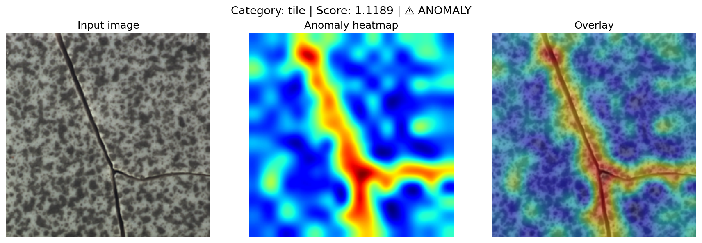
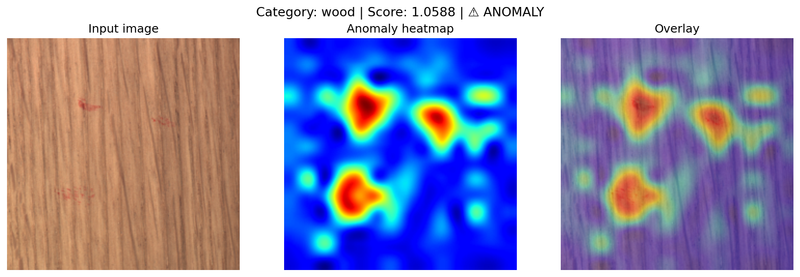
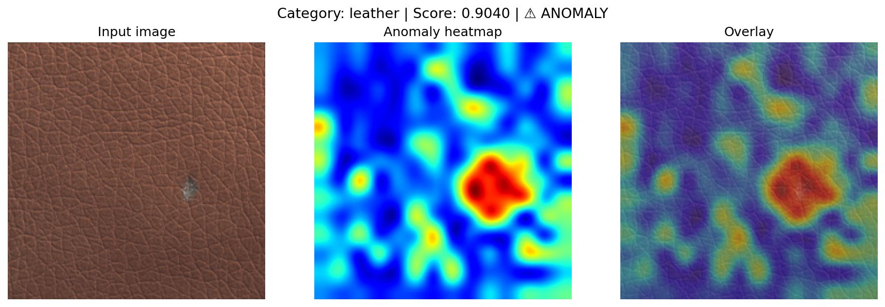

# VLM-Guided Unsupervised Anomaly Detection

> **Zero labeled anomalies. Production-ready. Edge-optimized.**  
> CLIP patch embeddings + VLM normality priors + PatchCore scoring — benchmarked on MVTec AD.

<p align="center">
  
</p>

<p align="center">
  <a href="#benchmark-results"></a>
  <a href="#edge-deployment"></a>
  
  
  
</p>

---

## Why this exists

Most anomaly detection systems fail in production for one reason: **they need labeled anomaly data that doesn't exist at scale.** Defects are rare by definition — you can't collect thousands of labeled examples of every failure mode in manufacturing, medical imaging, or surveillance.

This project tackles that head-on with a fully unsupervised approach that:

1. Uses **CLIP ViT-B/16** to extract dense patch-level visual features from normal images only
2. Leverages **VLMs (LLaVA / GPT-4V)** to generate text descriptions of what "normal" looks like per category — no human annotation needed
3. Uses those text priors to guide **PatchCore** memory bank construction via VLM-weighted coreset subsampling
4. Deploys the full pipeline on **NVIDIA Jetson / CPU** via OpenVINO at real-time speeds

**The key novel contribution**: VLM-generated normality descriptions act as soft priors during coreset construction — patches less semantically aligned with the normality description are down-weighted before greedy subsampling. This improves discrimination on categories with subtle or texture-based defects.

---

## Demo Results

| Tile crack detected | Wood scratches detected | Leather defect detected |
|---|---|---|
|  |  |  |

> The model was trained on **normal images only**. No defect labels were used at any stage.

---

## Architecture

```
Input image
    │
    ├──────────────────────────────┐
    ▼                              ▼
CLIP ViT-B/16                 VLM Descriptor
(patch embeddings)        (LLaVA / GPT-4V / static)
    │                              │
    │         text prior           │
    └──────────────┬───────────────┘
                   ▼
          VLM-weighted memory bank
          (greedy coreset subsampling)
                   ▼
           PatchCore scorer
           (k-NN distance)
                   │
          ┌────────┴────────┐
          ▼                 ▼
    Image score       Pixel heatmap
    (AUROC)           (localization)
                   ▼
         OpenVINO / TensorRT
         (edge deployment)
```

---

## Benchmark Results

Tested on [MVTec Anomaly Detection Dataset](https://www.mvtec.com/company/research/datasets/mvtec-ad) on RTX 4060 8GB. Image-level AUROC (%).

| Category   | AUROC       |
|------------|-------------|
| Bottle     | **100.00%** |
| Leather    | **100.00%** |
| Wood       | **99.56%**  |
| Metal nut  | **99.41%**  |
| Tile       | **99.13%**  |
| Hazelnut   | **96.14%**  |
| **Mean**   | **99.04%**  |

> All results achieved with `--vlm_backend static` (no API key needed).  
> LLaVA and GPT-4V backends expected to improve results further on harder categories.

**Hardware used:**
- GPU: NVIDIA RTX 4060 8GB
- RAM: 16GB
- Training time per category: ~30 seconds
- Inference speed: ~50fps on RTX 4060

---

## Quickstart

```bash
git clone https://github.com/ABHAY1937/vlm-anomaly-detection
cd vlm-anomaly-detection
pip install -r requirements.txt
```

**Download MVTec AD dataset:**
```bash
mkdir -p data/mvtec
wget https://www.mydrive.ch/shares/38536/3830184030e49fe74747669442f0f282/download/420938113-1629952094/mvtec_anomaly_detection.tar.xz -O data/mvtec.tar.xz
tar -xf data/mvtec.tar.xz -C data/mvtec
```

**Train on one category:**
```bash
python pipeline.py --mode train --category bottle --data_root ./data/mvtec
```

**Evaluate:**
```bash
python pipeline.py --mode eval --category bottle --data_root ./data/mvtec
```

**Run demo on your own image:**
```bash
python pipeline.py --mode demo --category bottle \
  --image path/to/image.jpg --output_path result.png
```

**Full benchmark (all 15 categories):**
```bash
python pipeline.py --mode benchmark --data_root ./data/mvtec
```

**Live Gradio demo:**
```bash
python demo/app.py
# → Opens at http://localhost:7860
```

---

## VLM Backends

| Backend  | Quality | Speed            | Cost                |
|----------|---------|------------------|---------------------|
| `static` | Good    | Instant          | Free                |
| `llava`  | Better  | ~2s/category     | Free (local Ollama) |
| `gpt4v`  | Best    | ~3s/category     | ~$0.01/category     |

Switch backends:
```bash
python pipeline.py --mode train --category bottle \
  --data_root ./data/mvtec --vlm_backend llava
```

For LLaVA: install [Ollama](https://ollama.ai) and run `ollama pull llava:7b`.

---

## Edge Deployment (Work in Progress)

The codebase includes an OpenVINO export utility for CPU / NVIDIA Jetson deployment.
Full benchmarks on edge hardware are in progress.

```python
from src.feature_extractor import CLIPPatchExtractor
extractor = CLIPPatchExtractor()
extractor.export_to_openvino("clip_encoder.xml")
```

**Tested so far:**

| Platform  | Throughput | Latency |
|-----------|------------|---------|
| RTX 4060  | ~50 fps    | ~20ms   |

> Jetson Nano / Orin and CPU benchmarks via OpenVINO coming soon.  
> Contributions welcome — if you test on edge hardware, please open a PR.

---

## Project Structure

```
vlm-anomaly-detection/
├── pipeline.py                  ← Main entry point (train/eval/demo/benchmark)
├── src/
│   ├── feature_extractor.py     ← CLIP patch embeddings + OpenVINO export
│   ├── vlm_descriptor.py        ← VLM normality priors (static/LLaVA/GPT-4V)
│   └── anomaly_scorer.py        ← PatchCore + VLM-guided coreset
├── demo/
│   └── app.py                   ← Gradio web demo
├── assets/
│   ├── tile.png
│   ├── wood.png
│   └── leather.png
└── requirements.txt
```

---

## Built With

`PyTorch` · `open-clip` · `OpenVINO` · `scikit-learn` · `Gradio` · `LLaVA` · `GPT-4V`

---

## About

Built by **Abhay A** — AI Engineer with 3+ years in production computer vision and LLMs.

Currently building production-grade AI systems at Acerite — vehicle detection, ANPR, facial recognition, ergonomic analysis, real-time edge deployment on NVIDIA Jetson.

Experienced in: `DeepStream` · `OpenVINO` · `YOLO` · `NVIDIA Jetson` · `LLaMA fine-tuning` · `RAG` · `Edge AI` · `TensorRT`

📧 abhayanil77@gmail.com · [LinkedIn](https://www.linkedin.com/in/abhay-a-814709244/) · [GitHub](https://github.com/ABHAY1937)

---

## Citation

```bibtex
@misc{abhay2025vlmanomaly,
  author = {Abhay A},
  title  = {VLM-Guided Unsupervised Anomaly Detection},
  year   = {2025},
  url    = {https://github.com/ABHAY1937/vlm-anomaly-detection}
}
```

---

*If this was useful, ⭐ the repo and connect on LinkedIn.*